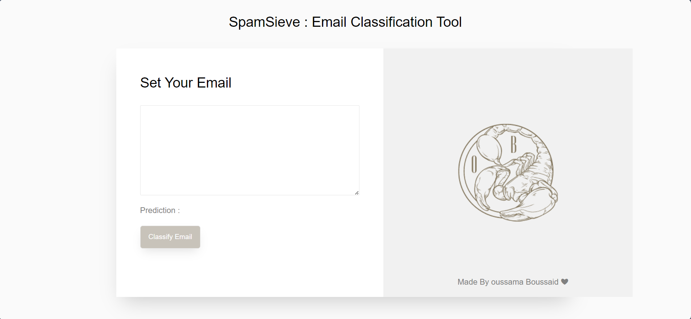

# **SpamSieve : Email Classification Tool**

# **Overview**

SpamSieve is an Email Classification Tool designed to categorize emails efficiently using Natural Language Processing (NLP) techniques and Long Short-Term Memory (LSTM) networks. The project encompasses a range of NLP preprocessing techniques to enhance email classification accuracy. Furthermore, the classification model is built using LSTM, a type of recurrent neural network (RNN) known for its effectiveness in sequential data processing tasks.

# **Techniques Used**

  - NLP Techniques:

    - Remove Header
    - Remove HTML Tags
    - Convert to Lowercase
    - Remove Hyperlinks
    - Remove Whitespace
    - Remove Digits
    - Remove Underscores
    - Remove Stopwords
    - Remove Special Characters
  - LSTM for Classification

# **Deployment**

The model is deployed as an API using Flask, offering seamless integration and interaction with other systems and applications. The Flask framework provides a robust environment for hosting the model, enabling efficient and reliable access to the classification functionality.

# **Prerequisites**

- nltk
- Bs4
- Flask
- os
- re
- json
- keras
- sklearn

# **Usage**

To utilize SpamSieve for email classification:

Ensure you have all Prerequisites installed on your system.
Clone the repository to your local machine.

    git clone https://github.com/oussama95boussaid/messages-emails-classifier.git
    
Navigate to the project directory.

    cd messages-emails-classifier

Run the Flask application using the command python SpamSieve.py.

    cd SpamSieve_deployment
    python SpamSieve.py

Once the application is running, you can interact with the classification API using appropriate requests.
